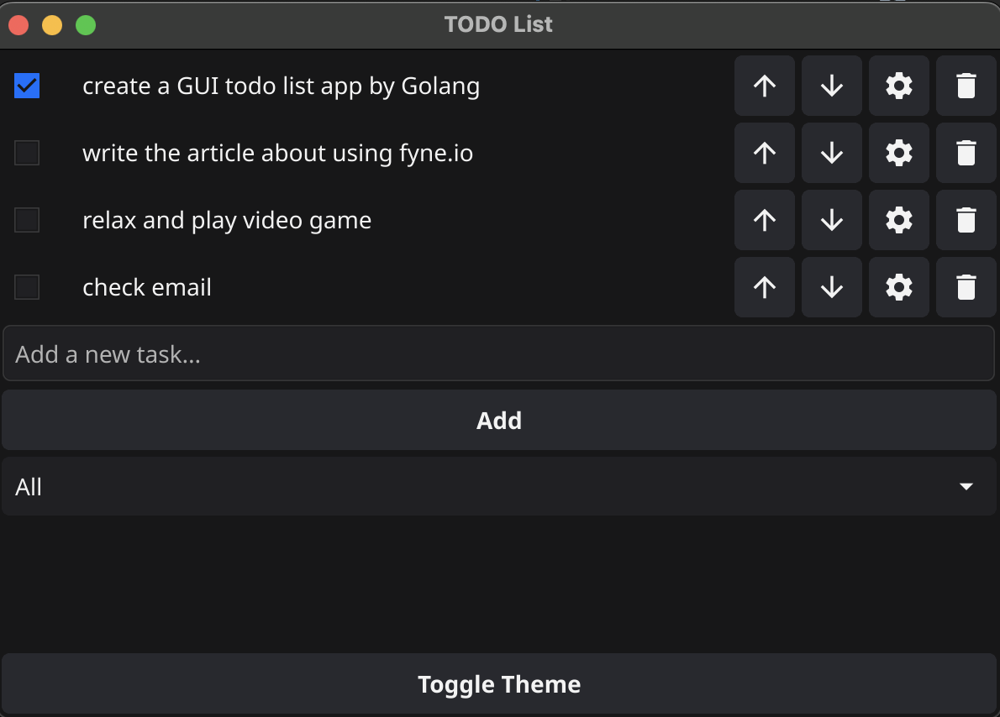
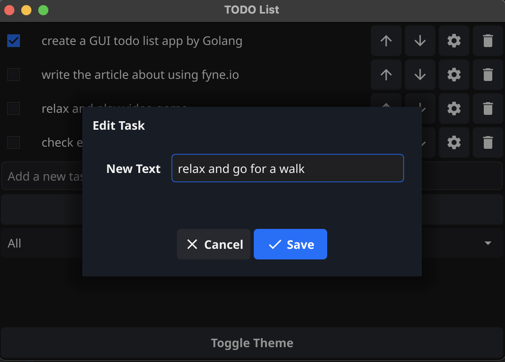
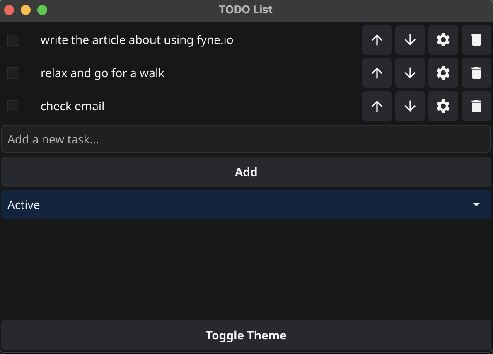
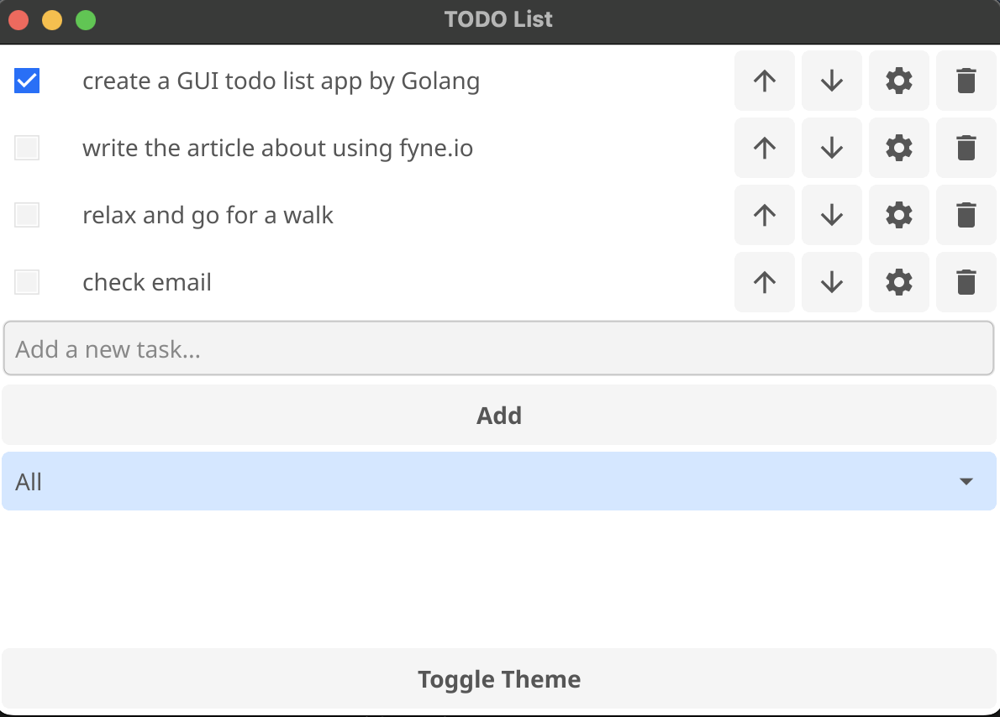

# Task Manager with Fyne

This is a cross-platform task management application built with [Fyne](https://fyne.io/), a graphical framework for Go. 

## Key Features

1. **Task Management:**
    - **Add Tasks:** Enter new tasks using the text field and add them with the "Add" button.
    - **Edit Tasks:** Click on the "Edit" button to modify an existing task.
    - **Delete Tasks:** Remove tasks using the "Delete" button.
    - **Mark as Completed:** Use the checkbox to mark tasks as completed.

2. **Task Organization:**
    - **Filtering:** Filter tasks by status (All, Active, Completed) using the dropdown menu.
    - **Reordering:** Change the order of tasks with "Move Up" and "Move Down" buttons.

3. **Persistent Storage:**
    - **Save and Load Tasks:** All tasks are saved to a `tasks.json` file and loaded automatically when the app starts.

4. **Theming:**
    - **Toggle Theme:** Switch between light and dark themes using the "Toggle Theme" button.

## Installation

1. Ensure you have [Go](https://golang.org/dl/) installed.
2. Clone the repository:
   ```bash
   git clone https://github.com/AndrivA89/fyne-todo-demo.git
   ```
3. Navigate to the project directory:
   ```bash
   cd fyne-todo-demo
   ```
4. Install dependencies and build the application:
   ```bash
   go build
   ```

## Running the Application

After building the app, run the following command:
   ```bash
   /fyne-todo-demo
   ```

## Screenshots

*The main screen of the application with the task list.*


*The dialog for editing a selected task.*


*The main screen of the application with the filtered task list.*


*White theme.*


